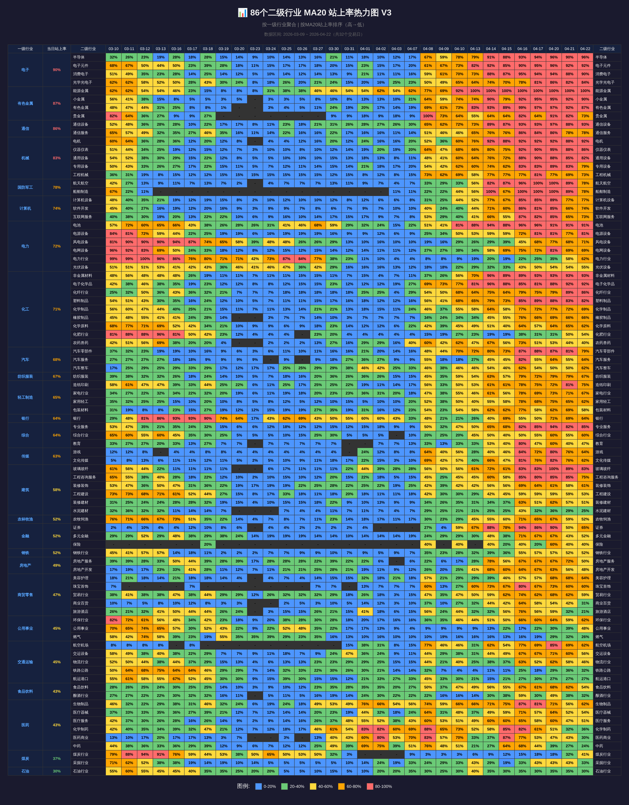

# 86 行业 MA20 站上率热力图
大盘云图市场宽度热力图生成工具。86个二级行业按一级行业聚合，显示为深色系宽表热力图 PNG。



## 功能特性
- **数据获取**：从大盘云图 API 抓取 86 个二级行业 MA20 站上率数据
- **行业聚合**：按一级行业聚合显示，二级行业独立展示
- **宽表格式**：左侧固定一级行业+二级行业，右侧重复二级行业名称
- **深色系热力图**：蓝 → 绿 → 黄 → 橙 → 红渐变
- **高清输出**：18,000 × 23,000 px (@2x)，PNG 格式

## 目录结构
```
allinone/
├── generate_86_industries_v3.py    # V3 主脚本
├── heatmap_86_v3.html               # 生成的 HTML 示例
├── heatmap_86_v3.png                # 生成的 PNG 示例
├── raw_86_data_v3.json              # 原始数据缓存
└── output/                          # 输出目录
    └── heatmap_86_v3_*.html/png     # 每次运行的输出
```

## 快速开始

### 环境要求
```bash
# Python 3.7+
python3 --version

# Node.js 18+ (用于截图)
node --version

# Playwright (首次运行需要)
npx playwright install chromium
```

### 一键生成热力图
```bash
cd allinone
python3 generate_86_industries_v3.py
```

运行后会在 `output/` 目录生成 HTML 和 PNG 文件。

## 输出说明

### 热力图结构
| 列 | 内容 |
|---|---|
| 第1列 | 一级行业名称（固定左侧） |
| 第2列 | 一级行业当日 MA20 站上率（固定） |
| 第3列 | 二级行业名称（固定） |
| 第4-34列 | 近31个交易日的 MA20 站上率 |
| 第35列 | 二级行业名称（固定右侧） |

### 排序规则
- 一级行业：按当日站上率降序排列
- 二级行业：按当日站上率降序排列

### 色阶定义
| 数值范围 | 颜色 | 说明 |
|---------|------|------|
| 0-20% | 蓝色 `#4d96ff` | 弱势 |
| 20-40% | 绿色 `#6bcb77` | 偏弱 |
| 40-60% | 黄色 `#ffd93d` | 中性 |
| 60-80% | 橙色 `#ffa502` | 偏强 |
| 80-100% | 红色 `#ff6b6b` | 强势 |

## 技术栈

- **Python 3**：数据获取、聚合、HTML 生成
- **Node.js + Playwright**：HTML → PNG 截图
- **HTML/CSS**：热力图模板渲染
- **API**：大盘云图行业 MA20 数据接口

## 部署为 OpenClaw Skill

### 1. 创建 Skill 目录
```bash
mkdir -p ~/.openclaw/workspace/skills/market-heatmap-v3
```

### 2. 复制文件
```bash
cp allinone/generate_86_industries_v3.py ~/.openclaw/workspace/skills/market-heatmap-v3/
cp assets/capture.js ~/.openclaw/workspace/skills/market-heatmap-v3/assets/
```

### 3. 创建 SKILL.md
```markdown
# market-heatmap-v3

86 行业 MA20 站上率热力图生成工具 V3。

## 触发词
- "生成热力图"
- "行业热力图"
- "市场宽度"

## 工具依赖
- python3
- node + playwright (chromium)

## 用法
python3 ~/.openclaw/workspace/skills/market-heatmap-v3/generate_86_industries_v3.py

## 输出
~/.openclaw/workspace/skills/market-heatmap-v3/output/heatmap_86_v3_*.png
```

### 4. 重启 OpenClaw
```bash
openclaw gateway restart
```

## 数据说明

### 数据来源
- **API**: `https://sckd.dapanyuntu.com/api/api/industry_ma20_analysis_page?page=0`
- **更新频率**：每日 16:00（收盘后）
- **Headers**: Referer + User-Agent

### 行业覆盖
- **26 个一级行业**：有色金属、医药、传媒、电子、机械、通信等
- **86 个二级行业**：各一级行业下的细分行业

## 使用场景
- **投顾服务**：为客户生成市场宽度可视化报告
- **交易策略**：追踪行业轮动与市场情绪变化
- **内容创作**：小红书、公众号等平台的财经图表素材

## 注意事项
- 首次运行需安装 Playwright Chromium
- 数据获取超时时间 30 秒
- 输出 PNG 约 1-2 MB
- V3 截图尺寸较大，生成时间约 10-20 秒

## 灵感与致敬
https://github.com/cyhzzz/market-breadth-heatmap-skill
